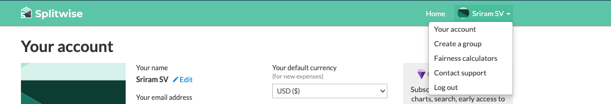
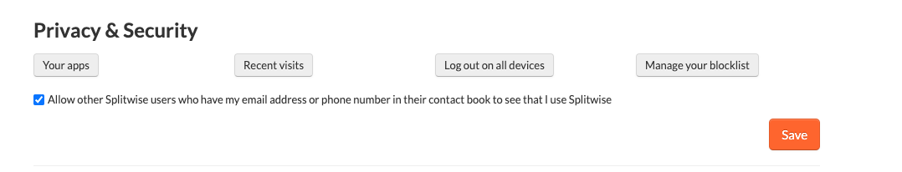
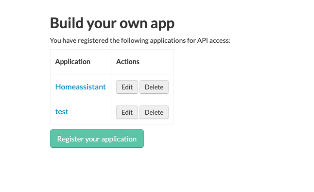
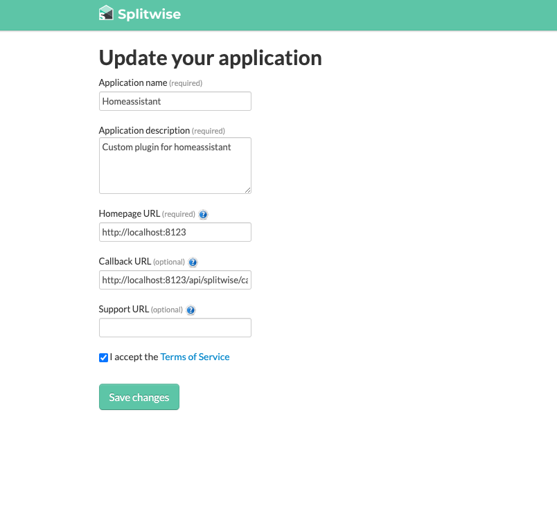
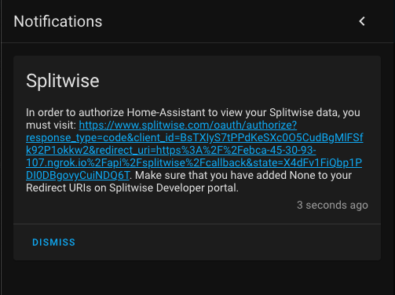
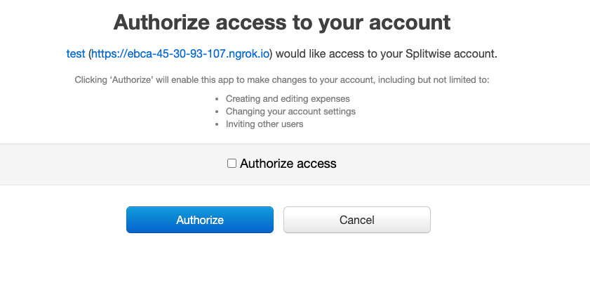
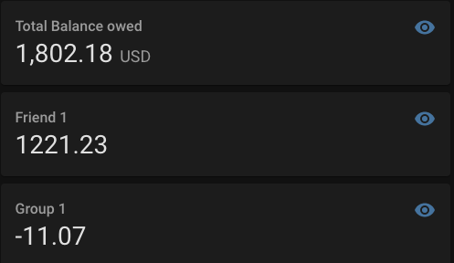

# Custom component for HomeAssistant for Splitwise API

This is a custom component integration for Splitwise API


### Splitwise Setup
- Login into https://secure.splitwise.com and login into your account
- Click on your `profile` and select `Your Account` 




- In the `Your Account` section, select `Your Apps` under the `Privacy and Security` section 



- Under the build your own app, click on `Register your Application` 




- Fill in the following sections
  - Application name: Homeassistant
  - Application Description: Homeassistant API Integration
  - Homepage URL: `http://localhost:8123` 
  - [Important] Callback URL: `http://localhost:8123/api/splitwise/callback` 

#### Note: 

If you are using a reverse proxy in front of your home assistant server, use the public address (`https://home.<your-domain>.com>/api/splitwise/callback`) as the callback URL in the application settings. Otherwise the oauth authentication won't work


- Click on `Register and get API key`
- Copy the `Consumer Key` and `Consumer Secret` values and store it some place safe


## Installation

### HACS:
- Search for `Splitwise Sensor` in HACS console and install it.

### Manual
- Copy the contents of the folder `custom_components/splitwise` into `<hass-config-directory>/custom_components/splitwise`

- Add the following lines to the `configuration.yaml` 


## Configuration
```yaml
sensor:
  - platform: splitwise
    client_id: '<consumer-id>'
    client_secret: '<consumer-secret>'
```

- Restart Homeassistant 
- Once you login to Homeassistant again, you should see a persistent notification with an authorization URL link in it: 


 

 - You will be redirected to the Oauth confirmation page from Splitwise to authorize Homeassistant to pull the data on your behalf. 

 
- Once you accept the Splitwise Oauth Callback, then sensor pulls the data from Splitwise API

## Final Output


# Advanced usage - events

This component will fire events:


The event types are defined in the [API documentation](https://dev.splitwise.com/#tag/notifications)
