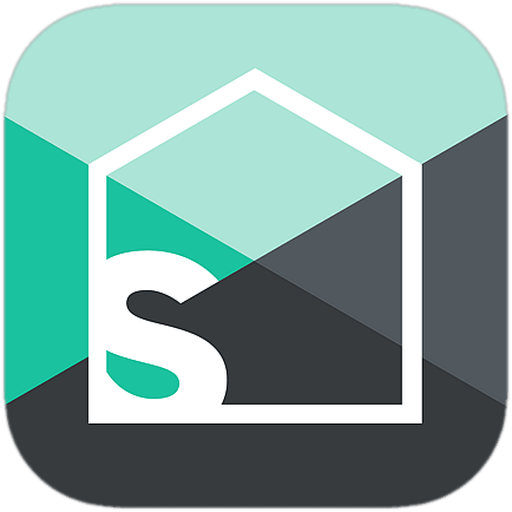
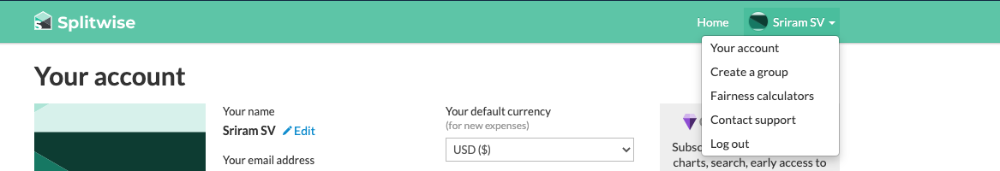
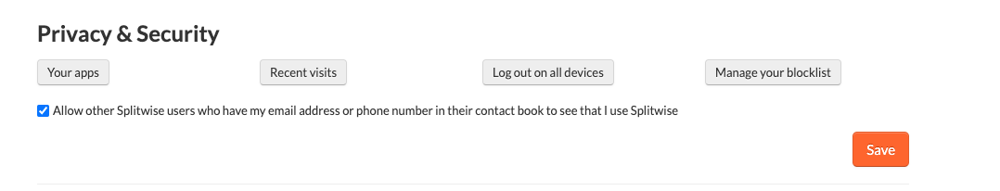
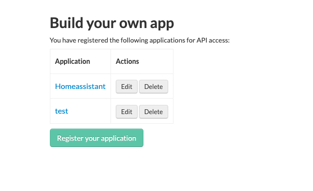
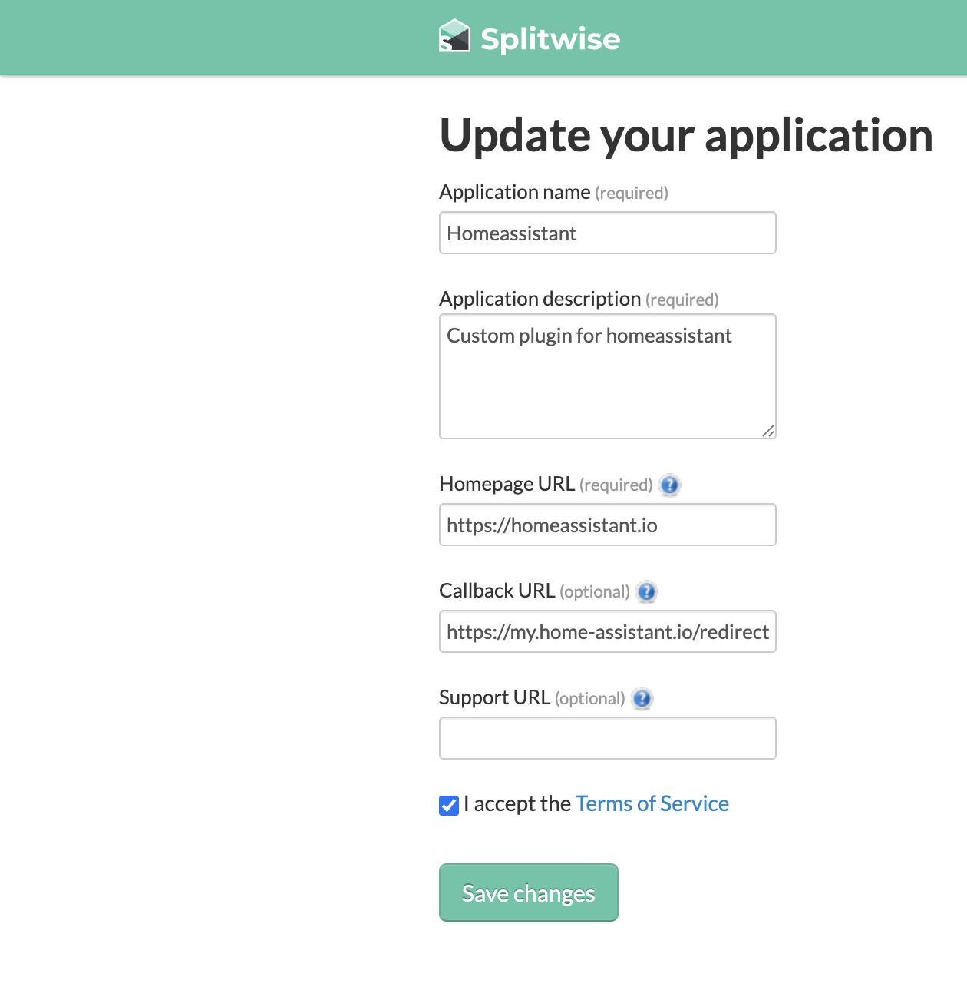
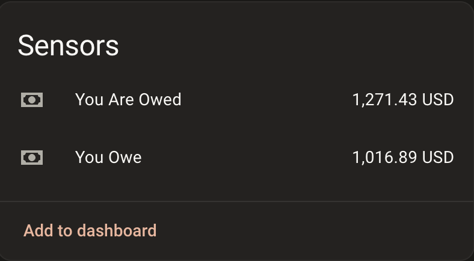

# Custom component for HomeAssistant for Splitwise API

This is a custom component integration for Splitwise API

### Splitwise Setup
- Login into https://secure.splitwise.com and login into your account
- Click on your `profile` and select `Your Account` 

- In the `Your Account` section, select `Your Apps` under the `Privacy and Security` section 

- Under the build your own app, click on `Register your Application` 

- Fill in the following sections
  - Application name: Homeassistant
  - Application Description: Homeassistant API Integration
  - Homepage URL: `https://www.home-assistant.io/`
  - [Important] Callback URL: `https://my.home-assistant.io/redirect/oauth`

This callback URL is fixed and works regardless of your network setup (local, reverse proxy, or Nabu Casa) — Home Assistant's own redirect service (`my.home-assistant.io`) forwards the OAuth callback to your instance automatically, so there's no need to figure out your own public address.

- Click on `Register and get API key`
- Copy the `Consumer Key` and `Consumer Secret` values and store it some place safe

## Installation

### HACS:

- Click the badge above (or search for `Splitwise Sensor` in the HACS console) to add this repository and install it.

### Manual
- Download the [latest release](https://github.com/sriramsv/custom_component_splitwise/releases/latest) and copy the contents of the folder `custom_components/splitwise` into `<hass-config-directory>/custom_components/splitwise`
- Restart Homeassistant

## Configuration

As of version 0.2.0, this integration is configured entirely through the Home Assistant UI — there is no more YAML configuration. If you have an existing `sensor: - platform: splitwise` block in `configuration.yaml`, remove it (Home Assistant will show a repair notice reminding you), and you can delete the old `splitwise.conf` token file from your config directory — it's no longer used.

1. Go to **Settings > Devices & Services > Application Credentials** and add a credential for **Splitwise**, using the Consumer Key/Secret from the app you registered above.
2. Go to **Settings > Devices & Services > Add Integration**, search for **Splitwise**, and follow the prompts.
3. You'll be redirected to Splitwise to authorize Home Assistant, then redirected back automatically once you approve.
4. Two sensors will populate shortly after: **Splitwise You Owe** and **Splitwise You Are Owed**, each with per-friend/per-group breakdown attributes for that side of the balance.

## Final Output

# Advanced usage - events

This component will fire events:

The event types are defined in the [API documentation](https://dev.splitwise.com/#tag/notifications)
